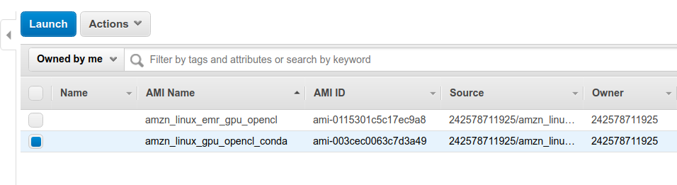

# Creating a GPU cluster in EMR

## Requirements
A GPU with working OpenCL installation is required for running `pyopencl` package, `pyopencl` is a dependency for `pyRQA` package which is used for generating features from raw signals using Recurrence Quantification Analysis.

## Pointers
1. The default Amazon Machine Image (AMI) used while creating a usual EMR cluster doesn't come with a GPU drivers installed.
2. A EC2 instance of **GPU Instances** type need to be used for for creating EMR nodes (both Master and Core nodes) to get access to GPUs. [I used `p2.xlarge` which comes with a `Tesla K80` GPU, `4` vCPUs and `61 GB` RAM]
3. There are 2 ways of installing required 3rd party packages in all the nodes.

	#### 1. Bootstrap Actions
	- Amazon provides us with an option where a bootstrap action script [shell script] can be executed in all the nodes of the cluster. When the EMR is done configuring all the clusters with spark, it reboots all the nodes, the bootstrap action is executed post this restart. We could use this to install all the required packages. [Reference](https://docs.aws.amazon.com/emr/latest/ManagementGuide/emr-plan-bootstrap.html)

    #### 2. Custom AMI
    - We could create our own custom AMI with all the required packages pre-installed and EMR will use this AMI to initiate the nodes rather than using the default AMI. But there are few constraints. This relatively a new feature released last year. [Reference](https://docs.aws.amazon.com/emr/latest/ManagementGuide/emr-custom-ami.html)
  
  	**EMR Constraints**
	- Only `Amazon Linux X64 AMI` is allowed, this is a flavor of `RHEL` not very friendly in terms of package installation unlike ubuntu.  
	- `pyopencl` needs to be need to be built from source, installation binaries are not available.  
	- This particular AMI ships with a version `gcc` and `g++` that does not work well when compiling and installing `pyopencl` package.  
	- Updating the `gcc` and `g++` results in bootstrap error while launching the EMR.  
	- Installing Nvidia OpenCL drivers directly on the base AMI was a time consuming task and failed because of the above mentioned reasons.


# Approach

A mix of custom AMI and bootstrapping was chosen, Using custom AMI we could reduce the installation overhead every time we launch a cluster. We could check the functioning of various packages at the time of AMI creation eliminating the possibility of installation errors at the time of cluster bootstrapping. The bootstrapping actions will be used to change  spark configurations.

## Creating a Custom AMI

- As a Base AMI we need to choose the latest version of Amazon Linux AMI from [here](https://aws.amazon.com/amazon-linux-ami/). Based on your region, select the EBS-HVM x86_64 version as this is a requirement for EMR.
AMI with id `ami-096629e5eb19568cc` and name *amzn-ami-hvm-2018.03.0.20181116-x86_64-ebs* was chosen in us-west region.

- Now using this image spin up a `p2.xlarge` EC2 instance, SSH in to the machine once it's up.

#### Installing Nvidia drivers
- Now use the following set of commands to install the required Nvidia graphics drivers for OpenCL.
[Reference](https://docs.aws.amazon.com/AWSEC2/latest/UserGuide/install-nvidia-driver.html)
```bash
sudo yum erase nvidia cuda
sudo yum update -y
sudo reboot
``` 

- Post reboot SSH into the instance again and execute the following commands.
```bash
sudo yum install -y gcc kernel-devel-$(uname -r)
wget http://us.download.nvidia.com/tesla/410.79/NVIDIA-Linux-x86_64-410.79.run
sudo /bin/sh ./NVIDIA-Linux-x86_64*.run
sudo reboot
```

#### Optimizing GPU setting
- Post reboot SSH into the instance again and execute the following commands. [Reference](https://docs.aws.amazon.com/AWSEC2/latest/UserGuide/optimize_gpu.html)
```bash
sudo nvidia-persistenced
sudo nvidia-smi --auto-boost-default=0
sudo nvidia-smi -ac 2505,875
```

- Since compiling `pyopencl` with default `gcc` and `g++` was not an possibility, A separate Anaconda environment was setup, as conda manages dependencies separately from the system defaults, this would solve our problem. SSH into the instance as `ec2-user` and start executing the following commands from the user root directory.

- Update all the packages
```bash
sudo yum update
```
- Get the latest Anaconda installer and execute
```bash
wget https://repo.continuum.io/archive/Anaconda3-2018.12-Linux-x86_64.sh
sudo su -
bash /home/ec2-user/Anaconda3-2018.12-Linux-x86_64.sh -b -p /opt/anaconda3
```
- Activte conda environment
```bash
source /opt/anaconda3/bin/activate
```

- Add conda-forge to channels
```bash
conda config --add channels conda-forge
```

- Install the required packages with conda, conda takes a long time in resolving the dependencies [> 30 mins]. Hence it makes sense not to install these packages using Bootstrap Actions, as EMR times out at ~22 mins, and cluster initiation would fail.
```bash
conda install -y -c anaconda cudatoolkit
conda install -y pytorch
conda install -y -c conda-forge pyopencl
pip install pyRQA
conda install -y pyedflib
conda install -y pyspark
pip install nolds
conda install -y boto3
```

- Copy the OpenCL folders from system installation to conda environment, so that conda packages knows that Nvidia GPU drivers are installed. [Reference](https://documen.tician.de/pyopencl/runtime_platform.html)
```bash
cp -r /etc/OpenCL/vendors/ /opt/anaconda3/etc/OpenCL/
```

- Finally we need to test if `pyopencl` and `pyRQA` packages are installed correctly and working. We could verify this with running the extended test that comes with `pyRQA` package.
```bash
python -m pyrqa.test --extended
```
##### Optional
- while the above test is running, SSH into the instance using another terminal window, and launch the Nvidia GPU utilization using the following command, to make sure that `pyrqa` is using the GPU.
```bash
nvidia-smi -l 1
```
you would see something like this, indicating `python` process is using the GPU.


## Saving the Custom AMI

- Using the actions option in the EC2 dashboard, create the an Image of the running instance.

- Now the AWS would automatically reboot the instance and save the Image with the above modifications.
- This might take few minutes, once done you can view the image in the `Images>AMI` tab.

- By default the AMI is private but it can be made public or shared with a set of AWS Account ids. This image can now be used for creating a spark-cluster in EMR by referring the `ami-id` of the Image.

## Starting a EMR Cluster

We will use the AWS command line utility to launch the cluster. 

- Install just `spark` and `livy` using the option `--applications Name=Spark Name=Livy`
- Specify your `ec2` attributes using `--ec2-attributes` flag
- choose Release of `emr-5.7.0` or later with `--release-label` option
- A S3 bucket has been created at `s3n://msds697-emr-log/elasticmapreduce/` for storing the cluster logs for trouble shooting, you can use `--log-uri` option specify the path to bucket.
- Use the `--custom-ami-id` option to specify EMR to use the AMI created in the above step.
- Use the `--instance-groups` option to specify EMR to launch the nodes as `p2.xlarge` instance type.
- The created AMI uses a EBS root volume of 30GB, it is better to allocate something more than 30GB for node's EBS root volume, `--ebs-root-volume-size` option is used to specify this.
- The only action that needs to be done before launching the spark cluster is to specify spark which python environment to use, spark defaults to `/usr/bin/python` but that doesn't contain the required packages so we will use bootstrap action to configure spark to point to the right python path, in our case it is `/opt/anaconda3/bin/python`. This is achieved by sending in the following configuration JSON,

```json
[{"Classification":"spark-env","Properties":{},"Configurations":[{"Classification":"export","Properties":{"PYSPARK_PYTHON":"/opt/anaconda3/bin/python"},"Configurations":[]}]}]
```

### Bootstrap Actions

we can use the bootstrap actions to install any further package, currently it is used to fix some environment bugs in EMR.

Refer to `bootstrap_script.sh` file in this `emr` directory.


#### Putting it all together

Run the following command to launch the EMR cluster.

```bash
aws emr create-cluster --applications Name=Spark Name=Livy \
  --ec2-attributes '{"KeyName":"$key-name",
                     "InstanceProfile":"EMR_EC2_DefaultRole",
                     "SubnetId":"$subnet-id",
                     "EmrManagedSlaveSecurityGroup":"$slave-security-group-id",
                     "EmrManagedMasterSecurityGroup":"$master-security-group-id"}' \
  --release-label emr-5.20.0 \
  --log-uri 's3n://msds697-emr-log/' \
  --instance-type p2.xlarge \
  --instance-count 2 \
  --configurations '[{"Classification":"spark-env",
                      "Properties":{},
                      "Configurations":[{"Classification":"export",
                                         "Properties":{"PYSPARK_PYTHON":"/opt/anaconda/anaconda3/bin/python"},
                                         "Configurations":[]}]},
                                         {"Classification":"yarn-site",
                                          "Properties":{"yarn.nodemanager.vmem-check-enabled":"false"},
                                          "Configurations":[]}]' \
   --bootstrap-actions Path=s3://eeg-aws-bootstrap-script/bootstrap_script.sh \
   --custom-ami-id ami-0c4922abab3466671 \
   --auto-scaling-role EMR_AutoScaling_DefaultRole \
   --ebs-root-volume-size 20 \
   --service-role EMR_DefaultRole \
   --enable-debugging \
   --repo-upgrade-on-boot SECURITY \
   --name 'P2xlargeGPUCluster' \
   --scale-down-behavior TERMINATE_AT_TASK_COMPLETION \
   --region us-west-2
```

#### Note
- Make sure in your Master node's security group has port 22 open for SSH.

## Testing spark
- Create a `check.py` with the following code, to check if everything is working with spark.

```python
import numpy as np
from pyspark import SparkContext
from pyrqa.opencl import OpenCL
from platform import python_version

opencl = OpenCL(platform_id=0, device_ids=(0,))
sc = SparkContext.getOrCreate()
rdd = sc.parallelize([1,2,3,4,5])
rdd = rdd.map(lambda x: np.sqrt(x))
res = rdd.glom().collect()

print('Result from spark: ', res)
print('Numpy Version: ', np.__version__)
print('Devices Available for OpenCL: ', opencl.devices)
print('Python Version used: ', python_version())
sc.stop()
```

Run the above file with `spark-submit` to verify the installation process.
```bash
spark-submit check.py
```

**Expected output**
```
Result from spark:  [[1.0], [1.4142135623730951], [1.7320508075688772], [], [2.0], [2.23606797749979]]
Numpy Version: 1.15.4
Devices Available for OpenCL: [<pyopencl.Device 'Tesla K80' on 'NVIDIA CUDA' at 0x1552ff0>]
Python Version used: 3.6.6
```