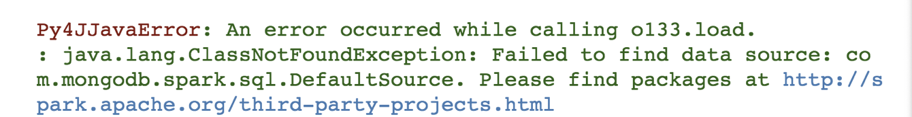
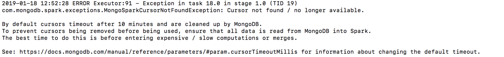

# Manually Deploy MongoDB on AWS (64-bit Amaxon Linux 2)
_Source: <https://docs.mongodb.com/manual/tutorial/install-mongodb-on-amazon/>_

## Table of contents
+ [Number of Servers Needed](#create_server)
+ [Setting up MongoDB](#setup_mongo)
	+ [Step 1: Create two security groups](#setup_mongo_1)
	+ [Step 2: Launch instances](#setup_mongo_2)
	+ [Step 3: Create 3-node replica sets for each shard](#setup_mongo_3)
	+ [Step 4: Create a 3-node replica set for config server](#setup_mongo_4)
	+ [Step 5: Configure mongos, add shards, and connect to clients](#setup_mongo_5)
	+ [Step 6: Sharding](#setup_mongo_6)
+ [Import data From AWS S3 to MongoDB servers](#import_data)
   + [Import Single File from S3 to MongoDB](#import_data_1)
   + [Bulk Import from S3 to MongoDB](#import_data_2)
+ [Connect MongoDB to PySpark](#mongo2spark)
	+ [Step 1 (Option 1): Starts the Pyspark Shell with Config from the Command Line](#mongo2spark_1)
	+ [Step 1 (Option 2): Create a SparkSession Object and Config in Python](#mongo2spark_2)
	+ [Step 2: Load Data from MongoDB](#mongo2spark_3)
	+ [Step 3: Trouble shooting with Mongo-Spark Connector](#mongo2spark_trouble)


## Environment Prerequisites
1. MongoDB 4.0.3
2. Spark 2.4.x
3. Scala 2.11.x or 2.12.x


## Instruction

### (1) Number of servers needed:<a name="create_server"></a>  
+ 1 server for the mongos  
+ 9 (3*3) servers for three shards (three replica set) (6-month, 12-month, 24-month)  
+ 3 server for the config server replica set


### (2) Setting up MongoDB:<a name="setup_mongo"></a>
#### Step 1: Create two security groups<a name="setup_mongo_1"></a>
+ **Internal access:** for communicating between shards, replicated nodes, configuration server and mongos
	+ Security group name: mongo\_internal\_access
	+ port 27017 - mongos
	+ port 27018 - shards
	+ port 27019 - config server
	+ Source: (Custom) the security group ID of the current security group
+ **External access:** for communicating with the clients from mongos
	+ Security group name: mongo\_external\_access
	+ port 27107 – Clients to mongos (same as mongos)
	+ Source: (Custom) the security group ID of the current security group
+ Also check your default security group to allow SSH on port 22

#### Step 2: Launch 13 instances<a name="setup_mongo_2"></a>

##### (1) Choose an Amazon Linux EC2 instance - **Amazon Linux 2 AMI (HVM), SSD Volume Type**  

_Amazon Linux 2 AMI (HVM) is only compatible with MongoDB 4.0 Community & Enterprise, while Amazon Linux AMI 2018.03.0 (HVM) is compatible with MongoDB 3.2, 3.4, 3.6, 4.0 Community & Enterprise._

+ 1 for mongos, 3 for configuration servers, 3 for shard1 (6-month), 3 for shard2 (12-month), 3 for shard3 (24-month)
+ Configuration:
	+ Instance type: t2.medium
	+ Storage optimized: recommended for NoSQL databases, but expensive
	+ Tag the EC2 instance with shard and replica name
	+ Configure Security Group:
		+ Make sure to choose **default** and **mongo\_internal\_access** for every instance
		+ For **mongos** instance, also choose mongo\_external\_access.  


##### (2) `ssh` to each instance and [install MongoDB](https://docs.mongodb.com/manual/tutorial/install-mongodb-on-amazon/) - using `.rpm` Packages (for Amazon Linux):
+ To launch the instance through terminal:
`ssh -i [.pem] ec2-user@[Public DNS(IPv4)]`
	+ .pem is your ssh key pair: /path/my-key-pair.pem
	+ your public DNS can be found in the instances page, it looks like: `ec2-198-51-100-1.compute-1.amazonaws.com`

+ Configure the package management system (yum):  
Create a `/etc/yum.repos.d/mongodb-org-4.0.repo` file so that you can install MongoDB directly using yum:  

```
sudo vi /etc/yum.repos.d/mongodb-org-4.0.repo
```

.repo file content is as below:  


```
[mongodb-org-4.0]  
name=MongoDB Repository  
baseurl=https://repo.mongodb.org/yum/amazon/2013.03/mongodb-org/4.0/x86_64/  
gpgcheck=1  
enabled=1  
gpgkey=https://www.mongodb.org/static/pgp/server-4.0.asc  
```

+ Install the MongoDB packages (the latest stable version):  
`sudo yum install -y mongodb-org`

	+ `yum` upgrades the packages when a newer version becomes available
	+ To unable the auto-update, if needed, add the following `exclude` directive to `/etc/yum.conf` file:  

		`exclude=mongodb-org,mongodb-org-server,mongodb-org-shell,mongodb-org-mongos,mongodb-org-tools`

+ Run `mongod` to check the installation  
`sudo service mongod start  #except for mongos ` 
+ Stop `mongod`  
`sudo service mongod stop`
+ Restart `mongod`
`sudo service mongod restart`


##### (3) Create an [AMI](https://docs.aws.amazon.com/AWSEC2/latest/UserGuide/AMIs.html) to create multiple instances with the same MongoDB environment  

+ First create an image: Instances - Actions - Image - Create Image
+ Then use the image to duplicate instance: Images - AMIs - Actions - Launch

##### (4) Then for each instance (Except for mongos):  

+ Create `/data/db`  
`sudo mkdir –p /data/db`

+ Change the owner of `/data/db` to `mongod`  
`sudo chown –R mongod:mongod /data/db`


#### Step 3: Create 3-node replica sets for shard 1, 2, 3<a name="setup_mongo_3"></a>

##### (1) In `/etc/mongod.conf` of each node, update the configuration  

`sudo vi /etc/mongod.conf`

+ under storage: set `dbPath` to `/data/db`
+ under network:
	+ set `port` to 27018 (or any port number assigned to shard instances)
	+ set `bindIP` to 0.0.0.0
+ Uncomment `replication` and set `  replSetName: rs1` (or rs2 or rs3)
+ Uncomment `sharding` and set `  clusterRole: shardsvr`

##### (2) Start `mongod` on each node using:  
`sudo mongod --config /etc/mongod.conf`

If we start the mongod server in this way with the config file, the server will keep running behind the stage until the user terminate it with:  

`ps aux | grep mongo` and `sudo kill [process ID]`

##### (3) Connect a mongo shell to the primary mongod instances for each shard and run `rs.initiate()`  

Usually we use the first replica, if it's currently a SECONDARY, just wait for the next vote and it would become a PRIMARY very quickly. 

```
  sudo mongo --port 27018  
  config = {
  			  _id : "rs1 (or rs2 or rs3)",
			  members:[{_id:0,host:"PRIVATE_IP_ADDRESS:27018"},
			           {_id:1,host:"PRIVATE_IP_ADDRESS:27018"},
			           {_id:2,host:"PRIVATE_IP_ADDRESS:27018"}]
			 }  
  rs.initiate(config)
```


#### Step 4: Create a 3-node replica set for config server<a name="setup_mongo_4"></a>

##### (1) On `/etc/mongod.conf` of each node, update the configuration  

`sudo vi /etc/mongod.conf`

+ under storage: set `dbPath` to `/data/db`
+ under network:
	+ set `port` to 27019 (or any port number assigned to the config instances)
	+ set `bindIP` to 0.0.0.0
+ Uncomment `replication` and set `  replSetName: config`
+ Uncomment `sharding` and set `  clusterRole: configsvr`

##### (2) Start `mongod` using:
`sudo mongod --config /etc/mongod.conf`

##### (3) Connect a mongo shell to one of the mongod instances and run `rs.initiate()` per shard

```
   sudo mongo --port 27019  
	config = {
  			  _id : "config_rs",
			  members:[{_id:0,host:"PRIVATE_IP_ADDRESS:27019"},
			           {_id:1,host:"PRIVATE_IP_ADDRESS:27019"},
			           {_id:2,host:"PRIVATE_IP_ADDRESS:27019"}]
			 }  
	rs.initiate(config)
```


#### Step 5: Configure mongos<a name="setup_mongo_5"></a>

##### (1) On `/etc/mongod.conf` of each node, update the configuration  

+ Comment the **storage** setting, as it is not going to store data
+ under network:
	+ set `port` to 27017 (or any port number assigned to the mongos instance)
	+ set `bindIP` to 0.0.0.0
+ Uncomment `sharding` and set:  
`  configDB: config/CONFIG_PRIVATE_IP:27019,CONFIG_PRIVATE_IP:27019,CONFIG_PRIVATE_IP:27019`

##### (2) Start `mongos` using:
`sudo mongos --config /etc/mongod.conf`

##### (3) Connect a mongo shell:  
`sudo mongo --port 27017`


#### Step 6: Sharding<a name="setup_mongo_6"></a>

##### (1) Assign 3 servers (as replica sets) to each shard :  

```
sh.addShard("rs1/PRIVATE_IP_ADDRESS:27018,PRIVATE_IP_ADDRESS:27018,PRIVATE_IP_ADDRESS:27018")
sh.addShard("rs2/PRIVATE_IP_ADDRESS:27018,PRIVATE_IP_ADDRESS:27018,PRIVATE_IP_ADDRESS:27018")
sh.addShard("rs3/PRIVATE_IP_ADDRESS:27018,PRIVATE_IP_ADDRESS:27018,PRIVATE_IP_ADDRESS:27018")
```

##### (2) Initialize Shards before Importing Data:

Notice: If we drop the collection, then we need to redo the sharding process for **this collection** even if we create it again with the same collection name.

+ Enabled sharding for the current database  
`sh.enableSharding("eeg")`

+ Create a shard key for each collection:  
Use the `sh.shardCollection()` method, specifying the full namespace of the collection and the target index or compound index to use as the shard key.  

```
sh.shardCollection( "eeg.eeg_metadata", {participant_group : 1, participant_id : 1} )
sh.shardCollection( "eeg.eeg_features", {participant_group : 1, participant_id : 1} )
sh.shardCollection( "eeg.tracking", {participant_group : 1, participant_id : 1} )
```

+ To prevent migration of the chunks across the cluster, disable the balancer first:

```
sh.disableBalancing("eeg.eeg_metadata")
sh.disableBalancing("eeg.eeg_features")
sh.disableBalancing("eeg.tracking")

sh.isBalancerRunning() # check
```

+ Add tags for the shards:

```
sh.addShardToZone( "rs1" , "6M")
sh.addShardToZone( "rs2" , "12M")
sh.addShardToZone( "rs3" , "24M")
```

+ Then define ranges for each zone:

```
# repeat this for each collection
sh.updateZoneKeyRange( 
    "eeg.eeg_metadata", 
    { participant_group : "06_month_EEG", participant_id: MinKey},
    { participant_group : "06_month_EEG", participant_id: MaxKey},
    "6M" 
)

sh.updateZoneKeyRange( 
    "eeg.eeg_metadata", 
    { participant_group : "12_month_EEG", participant_id: MinKey},
    { participant_group : "12_month_EEG", participant_id: MaxKey}, 
    "12M" 
)

sh.updateZoneKeyRange( 
    "eeg.eeg_metadata", 
    { participant_group : "24_month_EEG", participant_id: MinKey},
    { participant_group : "24_month_EEG", participant_id: MaxKey}, 
    "24M" 
)
```

+ Enable the balancer

```
sh.enableBalancing("eeg.eeg_metadata")
sh.enableBalancing("eeg.eeg_features")
sh.enableBalancing("eeg.tracking")

sh.isBalancerRunning() # check
```

+ To see the created chunks and distribution:

```
use eeg
db.printShardingStatus()
db.<collectionName>.getShardDistribution()
```


### (3) Import data From AWS S3 to MongoDB servers<a name="import_data"></a>

Three parts of data, all in json format:  

+ Time series features
+ Metadata
+ Tracking file

First, we need to run `aws configure` to set your AWS Access Key ID, Secret Access Key, and default region on the EC2 instance you are running mongos. You can get these information in your AWS account console.  

#### To Import Single file:<a name="import_data_1"></a>

`aws s3 cp s3://msds694-usfcaeeg/file_name - | mongoimport -d eeg -c $2 --port $3 --mode upsert`

#### Bulk import:<a name="import_data_2"></a>

_*Reference:_  
<https://unix.stackexchange.com/questions/9496/looping-through-files-with-spaces-in-the-names>
<https://www.datduh.com/blog/2017/7/28/load-json-files-to-a-mongodb-database-using-mongoimport-in-linux-or-windows>


Run `mongo_bulk_import.sh` (as below) to import all precessed files:  

```
# To run this example on the command line:
# 2
# collectionName is one of the following:
# eeg_metadata, eeg_features, tracking

OIFS="$IFS"
IFS=$'\n'
fileList=$(aws s3 ls s3://$1 --recursive | awk '{$1=$2=$3=""; print $0}' | sed 's/^[ \t]*//')

for f in $fileList; do
    #echo $f;
    echo "Processing $f file...";
    aws s3 cp s3://msds694-usfcaeeg/$f - | mongoimport -d eeg -c $2 --port $3 --mode upsert;
done
IFS="$OIFS"
```

If you have successfully set shards and sharding rules in the previous section, your data will be distributed on different shards based on the shard key, i.e., the participant test group. So all data belongs to 6-month, 12-month, and 24-month test groups will be kept separately on the three shards with no overlap.  


### (4) Connect MongoDB to PySpark - [MongoDB Spark Connector 2.4 (Python)](https://docs.mongodb.com/spark-connector/master/python-api/)<a name="mongo2spark"></a>

When loading data from MongoDB, we read each collection into a data frame, thus we will have three data frames:  

+ Participant metadata
+ Features generated from time series data
+ Tracking records of feature engineering process

#### Step 1 (Option 1): Starts the Pyspark Shell with Config from the Command Line<a name="mongo2spark_1"></a>

```
./bin/pyspark --conf "spark.mongodb.input.uri=mongodb://[server IP]/eeg.<collection>?readPreference=primaryPreferred" \
              --conf "spark.mongodb.output.uri=mongodb://[server IP]/eeg_out.result" \
              --packages org.mongodb.spark:mongo-spark-connector_2.11:2.4.0
```

+ The `spark.mongodb.input.uri` specifies:
	+ the MongoDB server address
	+ the database to connect (eeg)
	+ the collection (eeg\_metadata/eeg\_features/tracking) from which to read data
	+ the read preference (primaryPreferred) 
+ The `spark.mongodb.output.uri` specifies
	+ the MongoDB server address
	+ the database to connect (eeg_out)
	+ the collection (result) to which to write data
	+ it connects to port 27017 by default
+ The packages option specifies the Spark Connector’s Maven coordinates, in the format `groupId:artifactId:version`.

<br>

#### Step 1 (Option 2): Create a SparkSession Object in SageMaker and Config in Python<a name="mongo2spark_2"></a>

If you specified the `spark.mongodb.input.uri` and `spark.mongodb.output.uri` configuration options when you started pyspark (as above), the default SparkSession object uses them. By default the server will connect to mongos via `port 27017`.  

If you’d rather create your own SparkSession object from within pyspark, you can use `SparkSession.builder` and specify different configuration options:  

```
from pyspark.sql import SparkSession
import os

pyspark_submit_args = '--packages org.mongodb.spark:mongo-spark-connector_2.11:2.4.0 pyspark-shell'
os.environ["PYSPARK_SUBMIT_ARGS"] = pyspark_submit_args

my_spark = SparkSession \
    .builder \
    .appName("myEEGSession") \
    .config("spark.mongodb.input.uri", "mongodb://[server IP]/eeg.<collection>") \
    .config("spark.mongodb.output.uri", "mongodb://[server IP]/eeg_out.result") \
    .getOrCreate()
```

<br>

#### Step 2: [Load Data from MongoDB](https://docs.mongodb.com/spark-connector/master/python/read-from-mongodb/)<a name="mongo2spark_3"></a>

+ First check the security groups for the **mongos instance**. Make sure that you have **port 27017** open for all IPs (0.0.0.0/0) in the inbound rules for all security groups.   

+ Create a Spark DataFrame to hold data from the MongoDB collection specified in the `spark.mongodb.input.uri` option which your SparkSession option is using:  

```
sqlContext = SQLContext(my_spark)
dfr = sqlContext.read.format("com.mongodb.spark.sql.DefaultSource")
df = dfr.option("pipeline", "[{ $limit: 10 }]").load()
print("Schema:")
df.printSchema()
```

+ To read from another collection in the database, use the `.option` method when reading data into a DataFrame:  

```
df = my_spark.read.format("com.mongodb.spark.sql.DefaultSource").option("uri",
"mongodb://[server IP]/eeg.<another_collection>").load()
```

<br>

#### Step 3: Trouble shooting with Mongo-Spark Connector<a name="mongo2spark_trouble"></a>

(1) 
	
If you run into this error when calling `spark-submit`, first make sure you are in the correct anaconda environment, and then run the command by specifying the jar packages:  

`spark-submit --packages org.mongodb.spark:mongo-spark-connector_2.11:2.4.0 <file.py>`  

<br>

(2) 

If you run into this error during `sc.read.format().option("pipeline", query).load()`, here are two ways to solve this problem:  

+ Increase the cursor timeout limit:

	+ `mongod --setParameter cursorTimeoutMillis=10800000`
	+ Or if you start mongod from the config file directly, add this to /etc/mongod.conf:  
	
	```
	setParameter:
	  cursorTimeoutMillis: 10800000
	```

+ Before doing any expensive computation, cache the MongoRdd by **Action** first, then do other calculations in the Spark environment.  
It is because the mongod (or mongos) cursor can only point to a specific number of documents as a batch each time and pass it to the client. If the number requested documents exceed the batch size, the cursor will sit there and wait for all computations to be finished on the client side and then pass another batch. If this waiting time exceeds the cursor time out limit (10 minutes by default), the cursor will be killed and throw this exception.   
 
	To read more, see the [documentation](https://docs.mongodb.com/manual/reference/glossary/#term-cursor).